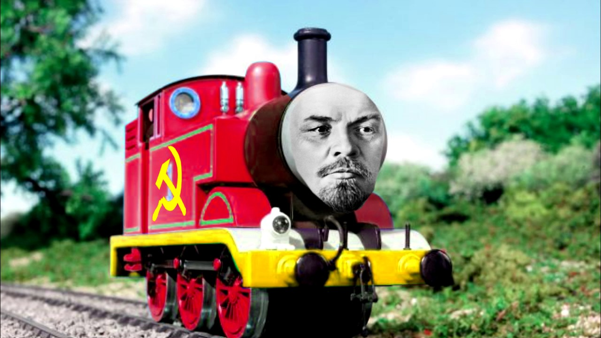

# ECE1140 - Team Tovarish

This Train System (transit system) is a standalone simulation of an entire transit system, including the control systems, (simulated) track, and (simulated) moving train. The system runs as-is, without any systems depending only on a computer running Windows 10 to run the system.


Image: https://www.youtube.com/watch?v=ZPZDP0S7MSo

## Installation

### Windows 10
1. Download and Install Python 3.11.0 here: https://www.python.org/downloads/release/python-3110/
   
2. Download and Install git here: https://git-scm.com/download/win

3. Open Git Bash

4. Change the current working directory to the location where you want the cloned directory

5. Copy https from Git Hub


6. Type git clone, and then paste the URL you copied earlier.
```bash
git clone https://github.com/fletch2001/ece1140-tovarish.git
```

7. Press Enter to create your local clone

8. In the ece1140-tovarish folder that you cloned, open a terminal at the root of the folder and run `python -m pip install -r requirements.txt'
   8a. If you don't have pip installed, you may need to install it. Instructions here: [](https://pip.pypa.io/en/stable/installation/)

10. Then, to run the whole system, run `python CTCWaysideTrackModelUI.py`
