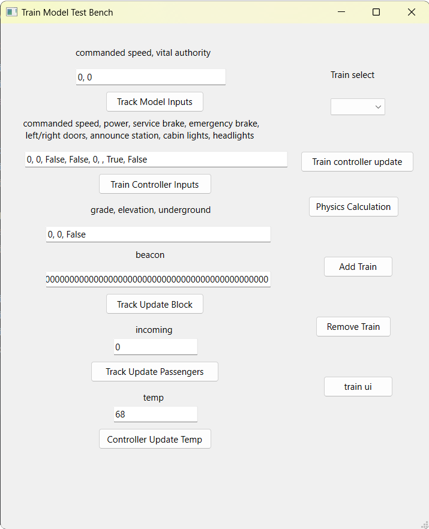

# Installation Guide For Train Model Test Bench :)

##### Pre Requisite Instalations
1. Python 3.11 or later
2. pyqt6

   pip install PyQt6

##### Required Files From Our GitHub
1. the entire contents of the Train_Model directory
2. the entire contents of the Train_Controller_HW directory
3. the entire contents of the Train_Controller_SW directory

##### Using the Train Model Test Bench
In the Train_Model directory launch the file train_model_container_testbench.py.
you will be faced with this UI:

Using this UI is largely strait forward. first by pressing Add train you can add a train 
to the container, all trains in the container can be selected using the Train select combo 
box. Each button is associated to the text box above that, above that text box is the format 
of the data that needs to be input. So as an example with Train 1 selected and "12, 13" in the 
Track Model Inputs text box if you press the Track Model Inputs button it will update Train 1's
incoming commanded speed and authority to Train 1 to 12 and 13 respectively.

There are a few exceptions to the general description of button behavior above.

Train controller update: This tells all the trains to update their respective train controllers 
and then update themselves in accordance with the controllers return values.

Physics Calculation: Runs the physics calculation of all the train, unfortunate it uses the time
from when you last pressed the button, so you often get large changes.

Track Update Block: This is controlled by the two text boxes above it.

train ui: Shows the train ui, this is largely needed for any testing and only doesn't show up
automatically because it would always crash :).

##### Final Notes
The train model testbench has access to the train controllers and no other module.

As of writing this, pressing Train controller update with more than one train crashes 
(this may change depending on the state of the Train_Controller_SW directory)

